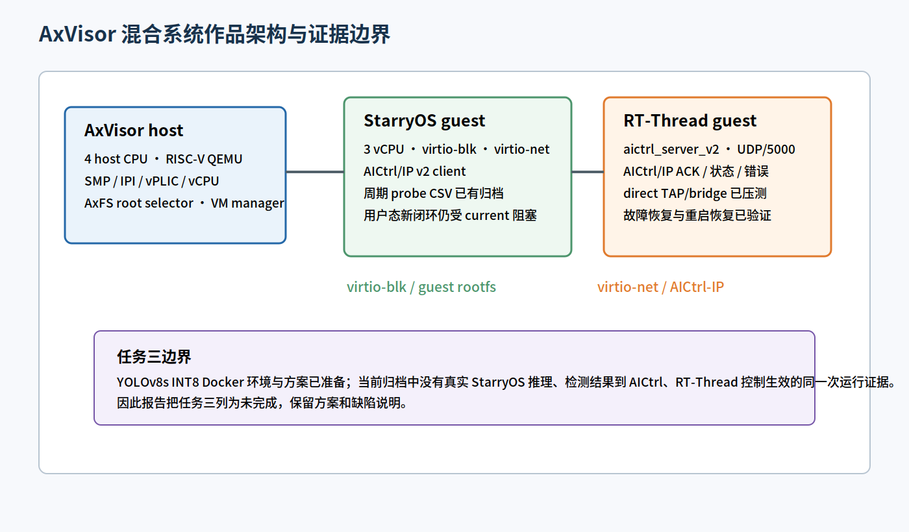
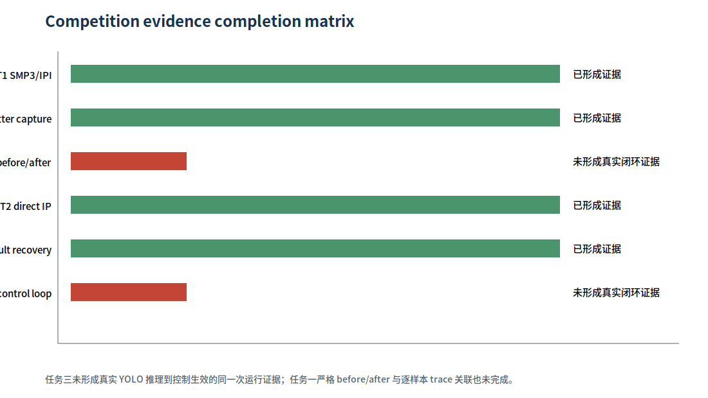
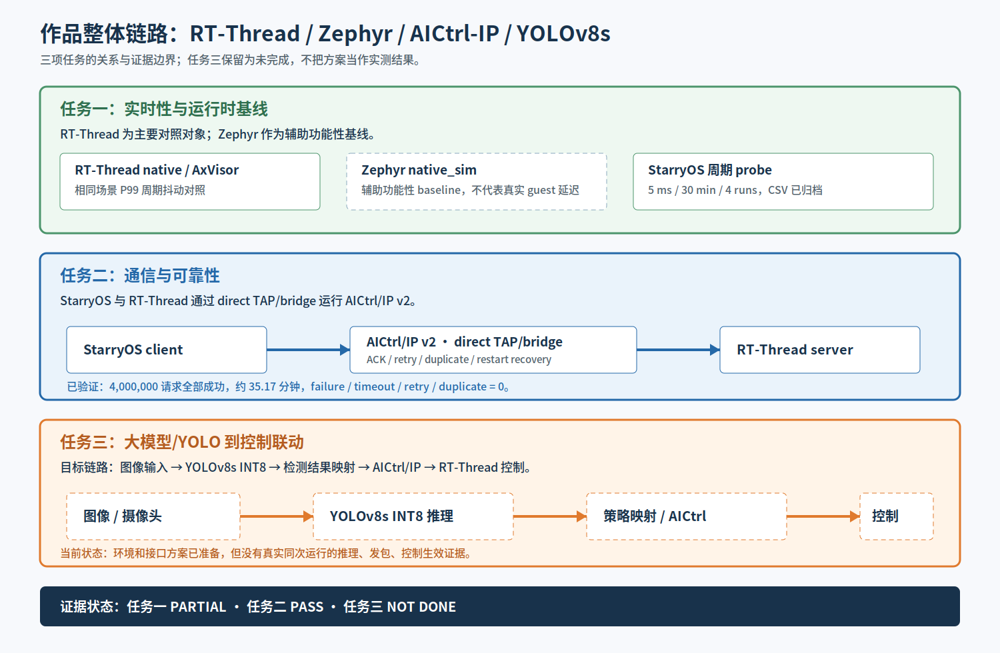
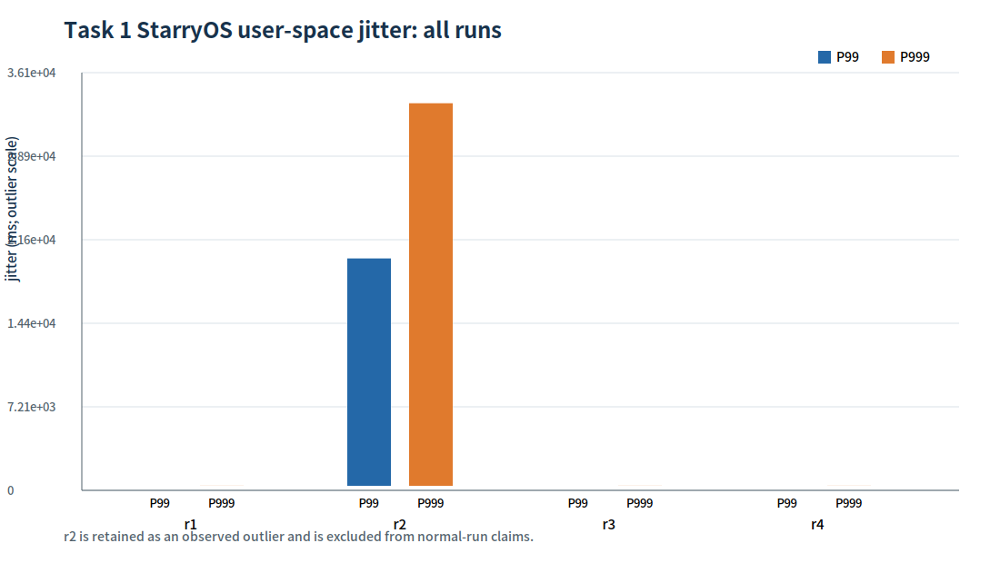
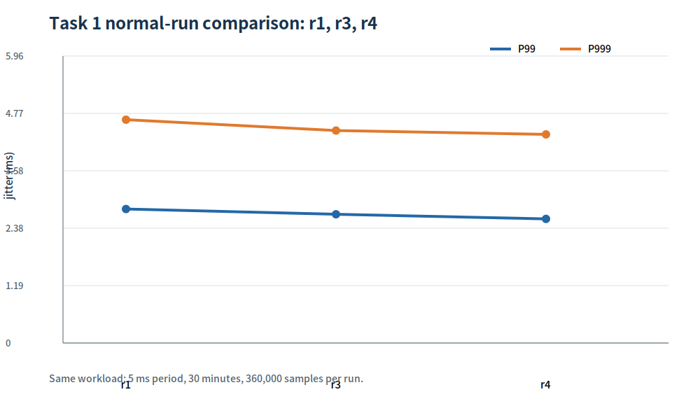
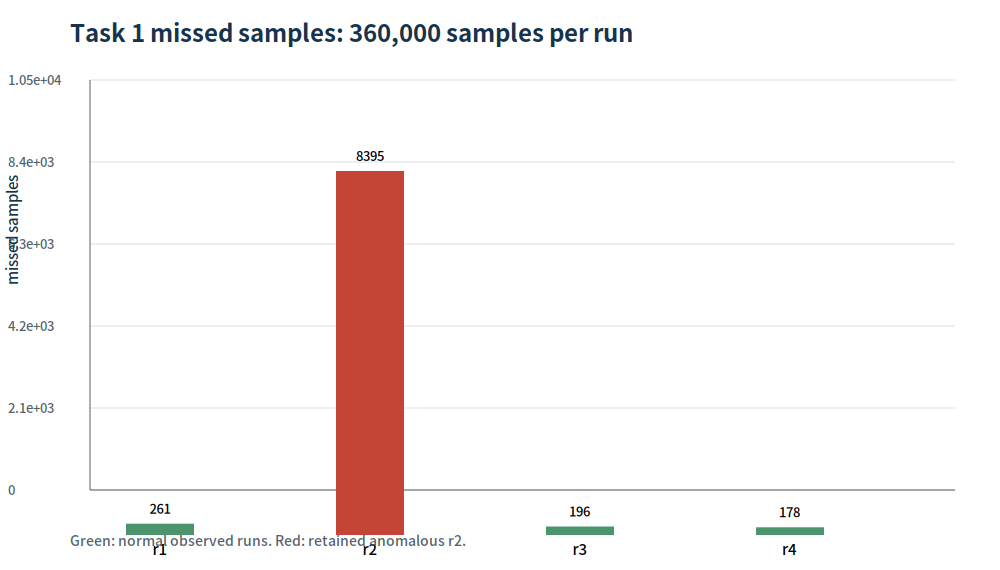
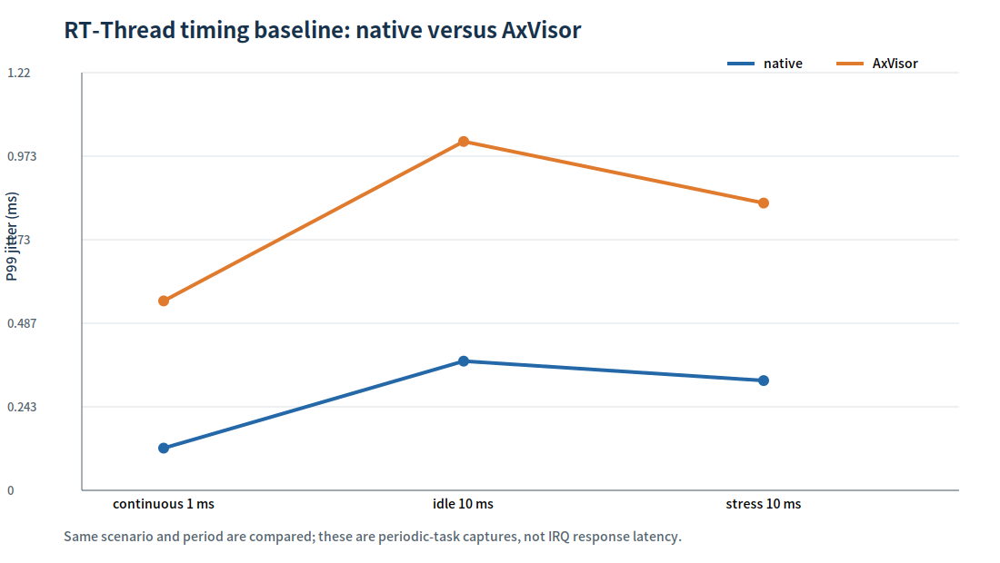
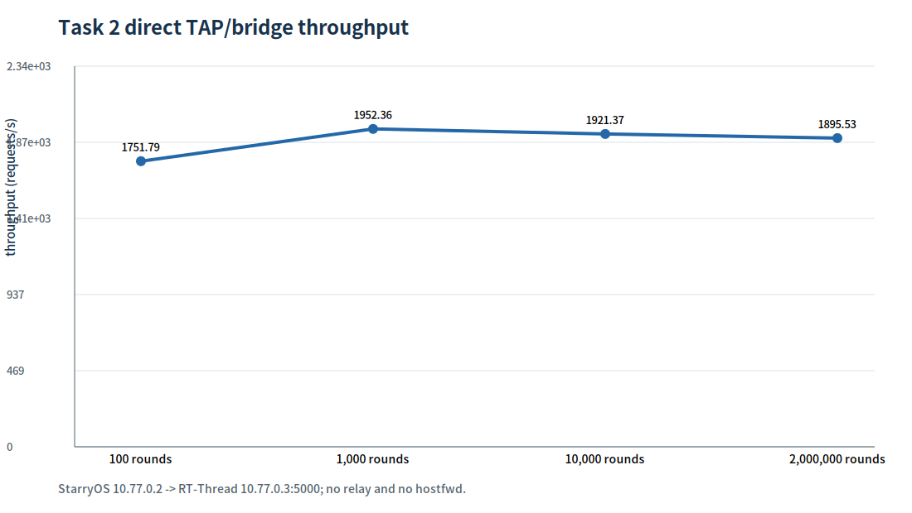
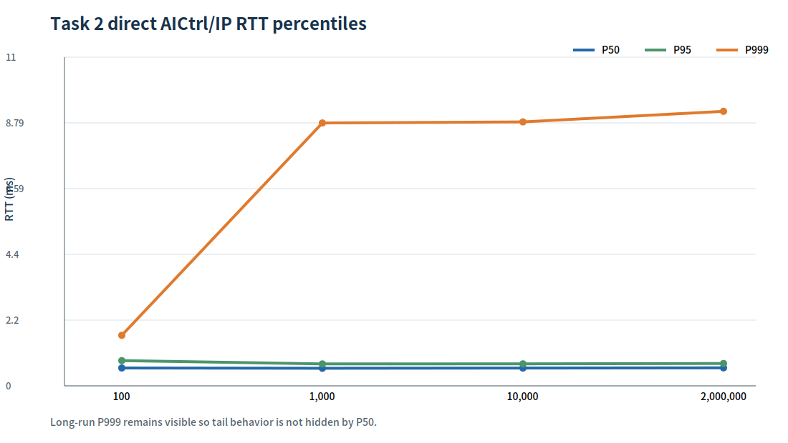
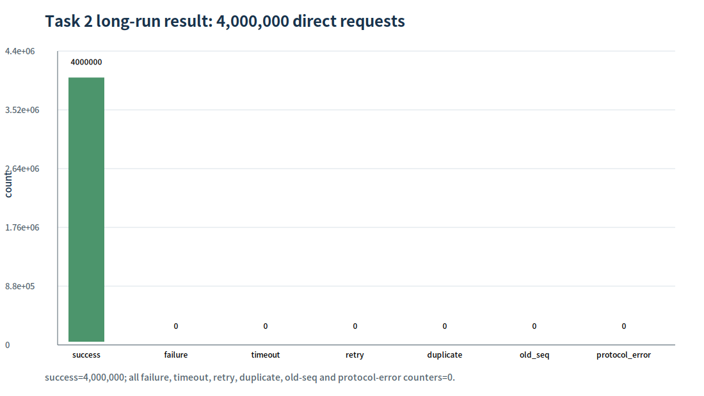

# AxVisor 混合系统作品技术报告

更新时间 2026-08-24

## 摘要

本作品围绕 AxVisor、StarryOS、RT-Thread 和 AICtrl/IP 通信链路展开。工程工作集中在三个层面。第一层是 AxVisor RISC-V 虚拟化底座，覆盖 SMP、IPI、虚拟 PLIC、中断投递、vCPU 运行和 guest root 选择。第二层是 StarryOS 与 RT-Thread 之间的 IP 网络控制通道，采用 direct TAP/bridge 拓扑和 AICtrl/IP v2 协议，完成了长时间压力、协议异常、丢包重传、服务端重启恢复和重复序号保护。第三层是任务三所需的 AI 推理联动方向，已经完成 YOLOv8s INT8 方案、Docker 环境和接口设计的准备，但当前归档材料中没有真实 YOLOv8s 推理结果经 StarryOS 发往 RT-Thread 并改变控制状态的同一次运行证据。

报告中的“已完成”只表示有原始日志、JSON、串口摘要或可复现实验支撑。“部分完成”表示链路的一段已经通过，但评分项仍缺少必要的闭环证据。“未完成”表示没有把方案材料当成实测结果。

## 1. 作品范围与验收口径

### 1.1 系统组成

```text
AxVisor host
  ├── StarryOS guest，3 vCPU，virtio-blk，virtio-net
  └── RT-Thread guest，AICtrl/IP v2 服务端

StarryOS 10.77.0.2  <-- UDP/IP over direct TAP/bridge -->  RT-Thread 10.77.0.3:5000
```

AxVisor 使用 4 个宿主 CPU，StarryOS 实验使用 3 个 vCPU。任务一的周期 probe 数据与任务二的 AICtrl/IP 数据分别归档，不能把不同运行拼成一条端到端证据。

### 1.2 证据等级

| 等级 | 含义 |
| --- | --- |
| PASS | 同一次实验或同一组可复现实验已有原始证据，结果可直接引用 |
| PARTIAL | 关键子路径通过，评分闭环仍缺少必要证据 |
| BLOCKED | 已定位阻塞点，无法从现有实验推出成功结论 |
| NOT DONE | 仅有设计、计划或环境材料，尚无实测闭环 |


### 1.3 作品目标与可验收输出

作品不是把三个孤立 demo 拼在一起，而是围绕一条可验证的控制路径组织工程：AxVisor 提供可启动、可隔离、可处理中断的 RISC-V 虚拟化底座；StarryOS 负责运行用户态采集程序和 AICtrl/IP 客户端；RT-Thread 负责接收控制参数、维护状态机并返回状态；任务三再把模型推理结果接入同一控制接口。

| 层次 | 输入 | 处理 | 输出 | 当前证据 |
| --- | --- | --- | --- | --- |
| 虚拟化底座 | QEMU RISC-V、4 个宿主 CPU、guest 镜像 | vCPU 调度、SMP/ IPI、vPLIC、virtio-blk/net、root selector | StarryOS/RT-Thread guest 可启动 | SMP3/IPI 两次 PASS；用户态 current 阻塞仍存在 |
| 实时性测量 | StarryOS 周期 probe、RT-Thread/Zephyr baseline | 记录 target、wakeup、finish、jitter、missed | CSV、P99/P999、对照图 | StarryOS 四次 30 分钟 CSV；RT-Thread baseline |
| 通信控制 | AICtrl/IP v2 请求、序号、控制参数 | 校验、状态机、ACK、重试、重复/旧序号处理 | STATUS_REPORT、错误码、控制状态 | direct 400 万请求 PASS；13 项协议 PASS |
| AI 联动 | 图像或视频帧 | YOLOv8s INT8 推理、后处理、策略映射 | CONTROL_SET、RT-Thread 控制状态 | 只有方案和接口设计，暂无实测闭环 |

因此，任务一和任务二的结果可以作为独立验收证据；任务三只有在模型输出、通信请求和 RT-Thread 状态变化带有同一 `run_id`/时间戳后，才能升级为端到端结果。

### 1.4 复现时必须保持的环境条件

报告中的数值只适用于归档时的实验边界。复现任务一时应保持 5 ms 周期、30 分钟时长、360,000 样本、相同 guest vCPU 配置和同一统计字段；复现任务二时应使用 `aictrl-br0`、两个 TAP 设备、10.77.0.2/10.77.0.3 地址、UDP 5000、无 relay、无 `hostfwd`，并分别保存 100、1,000、10,000 和 2,000,000 rounds 的串口摘要。更换 QEMU 参数、网卡拓扑、CPU 绑定或客户端重试策略后，结果应视为新实验，不能直接覆盖旧图表。

### 1.5 实验与数据的对应关系

报告中的图不是手工绘制的示意图，而是由仓库内数据重新生成的结果。对应关系如下。

| 图表 | 直接输入 | 图表回答的问题 | 不能回答的问题 |
| --- | --- | --- | --- |
| `task1_jitter_all_runs.png` | `task1-archive-summary.json` | 四次 StarryOS 运行的 P99/P999 和异常长尾 | IRQ 硬件响应延迟、优化前后因果 |
| `task1_jitter_normal_comparison.png` | 同一 JSON 中的 r1/r3/r4 | 排除异常 r2 后，正常运行的尾延迟是否稳定 | 异常 r2 是否可以从实验中删除 |
| `task1_missed_samples.png` | 同一 JSON 的 `missed` | 每次 360,000 样本中的漏采数量 | 漏采发生的具体调度事件 |
| `rtthread_native_axvisor_p99.png` | `rtthread-baseline-summary.json` | 同 scenario 下 native 与 AxVisor 的 P99 差异 | Zephyr 与真实 guest 的性能等价性 |
| `task2_direct_throughput.png` / `task2_direct_rtt.png` | `data/task2-direct/*.serial.log` | direct TAP/bridge 的吞吐和 RTT 尾部 | 应用控制效果、模型推理耗时 |
| `task2_longrun_outcomes.png` | longrun 串口摘要 | 400 万请求是否出现失败、超时或协议错误 | 任务三 AI 输出是否真实产生 |
| `overall_system_overview.png` | 架构和证据状态 | 三项任务怎样串成目标系统 | 三项任务是否同一次运行完成 |

`CSV` 保存逐样本事实，`JSON` 保存统计或验收结构，`LOG` 保存串口现场。三者不是三套重复数据，也不是每个文件都必须出现在图片中。

## 2. 总体结果







这三类图的关系是：任务一图表来自 StarryOS 周期 CSV 和 RT-Thread/Zephyr 基线 JSON，任务二图表来自 direct 串口 LOG 与协议 JSON，任务三在整体链路图中展示预期的 YOLOv8s 到 AICtrl/RT-Thread 控制路径。整体链路图用于说明作品结构，不代表三项任务已经在同一次运行中完成；任务三仍明确标为 NOT DONE。

| 任务 | 当前状态 | 已形成的最强证据 | 仍缺少的关键证据 |
| --- | --- | --- | --- |
| 任务一 | PARTIAL | SMP3/IPI 回归通过，StarryOS 5 ms 周期用户态 CSV 已归档 | 严格 before/after、AxVisor trace 与 guest probe 逐样本关联，当前新 Starry 用户态启动仍受 `current task is uninitialized` 阻塞 |
| 任务二 | PASS | direct TAP/bridge、AICtrl/IP v2、400 万请求长稳、故障注入与恢复 | 报告只引用已归档拓扑，未把 host-forward 旧结果混入 direct 结论 |
| 任务三 | NOT DONE | YOLOv8s INT8 联动方案、Docker 环境和接口方向 | 真实模型推理、检测结果映射、StarryOS 发包、RT-Thread 控制生效和闭环曲线 |

## 3. 任务一：AxVisor 虚拟化与实时性

### 3.1 SMP3 与 IPI 回归

任务一的核心底座已经完成 SMP3 回归。两次连续实验都出现 3 个 guest vCPU，StarryOS 或 guest 测试输出 `guest smp ipi pass!`，结果为 `PASS smp-ipi; 1/1 case(s) passed`。配套 AxFS root selector 测试为 4 passed，AxVM host test 为 149 passed。

证据文件为 `data/phase9-smp3-freeze.json`，原始日志位于外部交接材料中的 `task1-artifacts/logs/phase9-smp3-run1-fixed.log` 和 `phase9-smp3-run2-fixed.log`。本仓库保留机器可读汇总，避免复制大体积 guest 镜像。

这部分工作的技术价值在于，AxVisor 已经能够在 4 CPU 宿主上建立 3 vCPU guest，并让 guest SMP、IPI 和 VM 运行路径完成可重复回归。这里的“完成”指 SMP/虚拟化功能回归，不等同于实时性指标已经达标。

### 3.2 StarryOS 周期 probe 数据

当前可复现的 StarryOS 用户态周期数据来自 5 ms 周期、30 分钟、每次 360,000 个样本的四次运行。P99、P999、最大 jitter 和 missed 数量如下。

| 运行 | 样本数 | missed | missed rate | P99 | P999 | 最大值 |
| --- | ---: | ---: | ---: | ---: | ---: | ---: |
| r1 | 360000 | 261 | 0.0725% | 3.0976 ms | 4.7695 ms | 22.1791 ms |
| r2 异常样本 | 360000 | 8395 | 2.3319% | 19844.6414 ms | 33392.8945 ms | 34939.5569 ms |
| r3 | 360000 | 196 | 0.0544% | 2.9996 ms | 4.5659 ms | 51.4454 ms |
| r4 | 360000 | 178 | 0.0494% | 2.9128 ms | 4.4947 ms | 26.0117 ms |



r2 被保留为真实异常样本。它不能与 r1、r3、r4 合并后作为“正常最坏延迟”。排除 r2 后，三次正常运行的 P99 都约为 3 ms，P999 约为 4.5 至 4.8 ms。这个结果证明用户态周期采集链路确实能运行并留下大量样本，同时也暴露出异常运行的长尾风险。





需要严格限定这组数据的含义。它是 StarryOS 用户态 wakeup jitter，不是硬件 IRQ response latency，也没有包含同一次运行的 AxVisor trace 与 guest probe 逐样本对应关系。现有数据可以说明采集程序和统计脚本工作，不能单独证明实时性改善百分比。


### 3.2.1 测量定义与统计口径

周期 probe 每次按目标时间戳唤醒，记录 `target_ns`、`wakeup_ns`、`finish_ns` 和 `seq`。报告中的 jitter 采用 `wakeup_ns - target_ns`，`missed` 表示样本未能按周期窗口完成，P50/P95/P99/P999 直接在同一运行的样本集合上统计。四次 CSV 的序号都从 0 连续到 359,999，说明归档没有截断中间区间。

这组统计不能被解释成“平均每次只慢 3 ms”。P99 只表示 99% 样本不超过该值，P999 仍然保留长尾，最大值则反映极少数极端调度延迟。r2 的 P99 已达到 19,844.6414 ms，说明异常运行不是普通噪声，必须单独保留并在结论中说明。

### 3.2.2 StarryOS 四次运行的可比性

四次运行的 workload、周期和持续时间一致，均为 5 ms、30 分钟和 360,000 个样本，因此可以进行描述性横向比较。它们没有满足严格优化 before/after 所需的全部环境锁定条件，因此报告只给出“观察到的差异”，不计算优化百分比。

| 运行 | P50 | P95 | P99 | P999 | 最大值 | missed rate |
| --- | ---: | ---: | ---: | ---: | ---: | ---: |
| r1 | 0.2342 ms | 0.7555 ms | 3.0976 ms | 4.7695 ms | 22.1791 ms | 0.0725% |
| r2 | 0.2371 ms | 1.8003 ms | 19,844.6414 ms | 33,392.8945 ms | 34,939.5569 ms | 2.3319% |
| r3 | 0.2368 ms | 0.7154 ms | 2.9996 ms | 4.5659 ms | 51.4454 ms | 0.0544% |
| r4 | 0.2620 ms | 0.7103 ms | 2.9128 ms | 4.4947 ms | 26.0117 ms | 0.0494% |

正常三次运行的 P99 范围为 2.9128 至 3.0976 ms，跨度约 0.1848 ms；P999 范围为 4.4947 至 4.7695 ms。这个范围可以支持“正常运行下尾延迟量级相近”的表述，但不能支持“系统已经满足某个硬实时 deadline”的表述，因为报告没有给出外部 deadline、IRQ 入口时间和控制生效时间。

### 3.3 RT-Thread 与 Zephyr 参照数据

RT-Thread native 与 RT-Thread on AxVisor 都有原始串口 baseline。下图只比较相同 scenario 和 period 的 P99，避免把不同 workload 直接横向比较。



RT-Thread 的 AxVisor 运行在相同场景下通常比 native 有更高 P99，但该数据仍然是周期任务抖动，不能替代硬件中断延迟。Zephyr `native_sim/native/64` 使用虚拟时钟，得到的零 jitter 只能作为功能性 baseline，不能与真实 guest 延迟直接比较。


### 3.3.1 RT-Thread baseline 的具体数值

RT-Thread baseline 的采样量和场景并不相同，比较时必须保持 scenario 和 period 一致。下表将 JSON 中的纳秒值换算为毫秒，便于阅读。

| 场景 | 样本数 | native P99 / P999 | AxVisor P99 / P999 | AxVisor/native P99 |
| --- | ---: | ---: | ---: | ---: |
| continuous 1 ms | 2,000 | 0.110848 / 0.178320 ms | 0.544368 / 0.697600 ms | 4.91x |
| periodic idle 10 ms | 6,000 | 0.366896 / 0.568944 ms | 1.013568 / 1.394720 ms | 2.76x |
| periodic stress long 10 ms | 60,000 | 0.309936 / 0.522928 ms | 0.832304 / 1.276176 ms | 2.68x |

六组 baseline 的 `missed` 都为 0，但这只说明这些采集窗口内没有漏样，不代表 AxVisor 的调度开销为零。AxVisor 侧 P99 高于 native 是当前观测结果，不能直接归因于某一处代码，原因还可能包括 guest/host 调度、QEMU、虚拟时钟和采集环境。

Zephyr `native_sim/native/64` 的证据用途不同：它使用虚拟时钟，适合确认周期任务、统计代码和输出格式是否能工作；它不经过同样的 QEMU guest、virtio 和 AxVisor 调度路径，所以不放入上表的性能倍率计算。

### 3.4 当前未完成的严格实时性验收

以下两项没有被报告包装成 PASS。

1. 严格 before/after 对照没有满足同 workload、同 period、同 duration、同 host/QEMU/guest/toolchain 和 patch SHA-256 的配对条件。不同 SMP 配置或不同启动链路的结果不能计算优化百分比。
2. AxVisor trace、guest 串口 marker、Starry probe CSV、AICtrl 包和 RT-Thread 收包日志没有在同一次运行中用同一个 `(run_id, seq)` 完成逐样本关联。现有 `trace-correlation-manifest.json` 明确记录了 host runtime only 的边界。

最后一次重新构建的新 StarryOS 镜像已经能被 AxVisor 载入并启动到 StarryOS 内核，但在进入用户任务的 `current()` 路径上仍出现 `current task is uninitialized`，随后 guest `SystemDown`。因此没有把这次启动日志写成用户态 probe 已成功执行。

## 4. 任务二：StarryOS 与 RT-Thread 的 AICtrl/IP

### 4.1 Direct TAP/bridge 拓扑

任务二采用真实 direct IP 拓扑。

| 组件 | 地址 | MAC | 作用 |
| --- | --- | --- | --- |
| StarryOS | 10.77.0.2/24 | 52:54:00:77:00:02 | AICtrl/IP v2 client |
| RT-Thread | 10.77.0.3/24 | 52:54:00:77:00:03 | AICtrl/IP v2 server |
| Ubuntu bridge | 10.77.0.1/24 | 由 bridge 配置提供 | 仅承载二层转发 |

StarryOS 和 RT-Thread 的 QEMU 网卡分别接入 `aictrl-starry` 与 `aictrl-rt` 两个 TAP，再加入 `aictrl-br0`。direct 运行没有 UDP relay 进程，也没有 QEMU `hostfwd`。这一点很重要，因为旧的 host-forward 和 relay 结果不能冒充最终 direct guest-to-guest 结果。

### 4.2 协议设计

AICtrl/IP v2 使用固定头部、显式 little-endian 字段、session_id、序号、Q16.16 控制参数、校验和和响应来源检查。核心消息包括 `CONTROL_SET`、`CONTROL_ACK`、`STATUS_GET`、`STATUS_REPORT`、`ERROR_NOTIFY` 和 heartbeat 相关字段。

服务端对序号执行三类处理。新序号应用一次并回 ACK，重复序号回相同 ACK 但不重复应用，旧序号返回 old-seq 错误并保持当前控制状态。客户端实现 ACK 等待、超时、重试标志和 CSV 输出。


### 4.2.1 AICtrl/IP v2 的报文与状态机

协议采用固定头部和显式 little-endian 编码，控制参数使用 Q16.16 表示。每个请求携带 session 和 sequence，服务端在校验 magic、version、message type、payload length 和 checksum 后才进入状态机。这样可以把“UDP 收到数据”和“控制状态确实更新”区分开。

服务端的序号语义如下。

| 输入序号 | 服务端动作 | ACK/错误行为 | 控制状态 |
| --- | --- | --- | --- |
| 新序号 | 应用一次控制参数并更新 `last_seq` | 返回成功 ACK | 允许变化 |
| 重复序号 | 不再次应用，复用该序号结果 | 返回可重复读取的 ACK | 保持不重复变化 |
| 旧序号 | 拒绝过期请求 | 返回 `old_seq` 错误 | 保持不变 |
| 非法报文 | 不进入控制应用路径 | 返回对应错误码或 `ERROR_NOTIFY` | 保持不变 |

协议测试运行 ID 为 `20260813T221609`，13 项全部 PASS。测试不仅覆盖成功路径，还覆盖错误后继续控制，最后检查状态仍能恢复到 `strategy_id=9`、`kp=0.75`、`ki=0.0625`、`kd=0.015625`。

13 项测试的实际覆盖面为：`initial_status`、`control_apply`、`status_feedback`、`duplicate_sequence`、`old_sequence`、`bad_magic`、`bad_version`、`bad_message_type`、`bad_control_length`、`bad_status_length`、`bad_checksum`、`control_after_errors`、`final_status_after_recovery`。其中 `old_sequence` 返回错误码 6，非法 magic/version/type/length/checksum 分别进入错误路径；`control_after_errors` 证明服务端在错误报文后仍能接受合法控制，`final_status_after_recovery` 则检查状态反馈没有被错误测试破坏。该清单对应 `data/aictrl_protocol.json`，不是从长稳吞吐数据推断出来的。

### 4.3 Direct 压力结果





| 轮数 | 请求数 | 成功 | P50 | P95 | P99 | P999 | 吞吐 |
| ---: | ---: | ---: | ---: | ---: | ---: | ---: | ---: |
| 100 | 200 | 200 | 483 us | 731 us | 1175 us | 1587 us | 1751.79 rps |
| 1000 | 2000 | 2000 | 473 us | 620 us | 825 us | 8766 us | 1952.36 rps |
| 10000 | 20000 | 20000 | 481 us | 622 us | 784 us | 8801 us | 1921.37 rps |
| 2000000 | 4000000 | 4000000 | 487 us | 636 us | 795 us | 9158 us | 1895.53 rps |

长稳实验持续 2,110,227 ms，约 35.17 分钟。4,000,000 个请求全部成功，failure、timeout、retry、duplicate、old_seq 和 protocol_error 全部为 0。




### 4.4.1 压测指标如何解读

每一轮的 `requests` 是双向控制请求总量，RTT 单位为微秒，吞吐由成功请求数除以持续时间得到。长稳轮次使用 2,000,000 rounds、4,000,000 requests，持续 2,110,227 ms；平均吞吐约 1,895.53 requests/s。P50 487 us 代表常态往返成本，P999 9,158 us 代表尾部，不应只引用 P50 来宣称通信实时性。

四轮吞吐从 1,751.79 到 1,952.36 requests/s，再到长稳的 1,895.53 requests/s，说明短轮和长轮量级一致。长稳过程中 failure、timeout、retry、duplicate、old_seq、protocol_error 均为 0，支持“在该受控环境和该 workload 下稳定完成”的结论，但不等于所有网络拥塞、宿主过载或 guest 重启场景都已覆盖。

### 4.4 协议与故障恢复

任务二的协议测试覆盖初始状态、控制应用、状态反馈、重复序号、旧序号、错误 magic、错误 version、错误消息类型、错误控制长度、错误状态长度、错误 checksum，以及错误后的继续控制和最终状态检查，共 13 项，全部 PASS。

现场故障注入也有独立证据。

| 场景 | 结果 |
| --- | --- |
| 首个 request 丢失 | 第一次超时，后续重传成功 |
| 首个 reply 丢失 | 客户端重传后成功，服务端不重复应用 |
| RT-Thread 重启 | session 与状态恢复，之后继续处理 |
| 重复序号 | ACK 可重复读取，控制状态不重复变化 |
| 重试耗尽 | 达到最大重试次数后按失败退出 |
| ERROR_NOTIFY | 独立运行探针收到错误类型与错误码 |
| direct TAP 100% 丢包窗口 | 发生一次 timeout，重传后恢复，最终成功 |

这些证据表明任务二已经超出“UDP 能通”的层次，形成了协议字段、状态机、错误处理、重传和恢复验证。任务二报告结论为 PASS，依据是 direct 拓扑和独立故障证据，不依赖 host-forward 旧结果。

## 5. 任务三：YOLOv8s INT8 与控制联动

### 5.1 已完成的准备工作

任务三方向已经明确使用 Docker 中的 YOLOv8s INT8 模型，并计划把任务二的 AICtrl/IP 作为控制输出通道。方案材料已经说明 QEMU 阶段需要 CPU/NCNN 等真实 CPU 后端，RK3588 板端才适合使用 RKNN/RKNPU2。模型输入预处理、YOLO 后处理、检测结果到动作或策略的映射、AICtrl/IP 扩展和 RT-Thread 控制安全边界都已经有设计。

现有任务二服务端已经具备接收控制参数、检查版本和序号、回 ACK、回状态以及异常恢复的能力。这为任务三提供了可复用的通信和安全边界。

### 5.2 当前没有形成的证据

本报告不声称任务三已经完成。当前归档中没有以下同一次运行证据。

- StarryOS 或指定 Linux 客户机加载 YOLOv8s INT8 模型并完成真实推理。
- 图像预处理、推理、后处理输出检测框或类别结果。
- 检测结果转换为 AICtrl/IP `CONTROL_SET` 并发给 RT-Thread。
- RT-Thread 收到模型输出后改变控制状态，再通过 `STATUS_REPORT` 返回。
- 模型推理耗时、网络 RTT、参数生效时间和控制效果 CSV。
- 固定策略与 AI 策略的同场景对比曲线。

因此任务三状态是 NOT DONE。这里的缺口来自真实端到端实验没有完成，不是图表或文档缺失。把计划文档中的“准备接入”改写成“已完成推理”会造成事实错误。


### 5.3 任务三真正闭环所需的实验设计

任务三不能只补一张模型截图，至少需要在同一次运行中保存以下事件序列：

```text
frame_id / timestamp
  -> preprocess_start / preprocess_end
  -> inference_start / inference_end
  -> detection_count / class / confidence / bbox
  -> policy_decision
  -> AICtrl CONTROL_SET(seq, strategy_id, parameters)
  -> CONTROL_ACK
  -> RT-Thread STATUS_REPORT
  -> control_effect timestamp / actuator state
```

建议把 `frame_id`、`run_id` 和 AICtrl `seq` 写入同一份 CSV 或 JSONL，并同时保存模型版本、量化版本、输入分辨率、推理后端、CPU 频率、线程数和网络配置。只有这样才能分别计算模型推理耗时、网络 RTT、参数生效时间和端到端控制周期。

任务三的最小验收矩阵应包括：

| 验收项 | 必须观察到的证据 | 当前状态 |
| --- | --- | --- |
| 模型加载 | 模型文件哈希、量化配置、后端和启动日志 | 方案已准备，未归档实测 |
| 推理输出 | 至少一组带 frame_id 的检测框/类别/置信度 | 未完成 |
| 协议接入 | 同一 frame_id 对应的 CONTROL_SET、ACK、seq | 未完成 |
| RT-Thread 生效 | STATUS_REPORT 与控制对象状态变化 | 未完成 |
| 时延统计 | preprocess、inference、postprocess、network、apply 分段时间 | 未完成 |
| 对照实验 | 固定策略与 AI 策略同场景曲线 | 未完成 |

当前任务三的 Docker、接口和安全边界属于工程准备，不应计入上述实测 PASS。

## 6. 代码与工程方法

### 6.1 虚拟化底座

已形成的工程工作包括 RISC-V guest 地址与镜像重新生成、AxVisor guest 内存映射修正、PCI 禁用项清理、virtio-blk file backend、guest rootfs 隔离、SMP3/4 vCPU 配置、vPLIC 与 vCPU 中断路径调试，以及当前 RISC-V CPU-local current header 的 fallback 方向修复尝试。

这些修改使 guest 能够真正载入内核、识别虚拟块设备并进入 StarryOS 内核。最后的用户态阻塞仍然保留，报告不把内核启动等同于用户态成功。

### 6.2 可复现与证据隔离

报告复制的是小体积机器可读结果、串口摘要和四份周期 CSV。大体积 guest 镜像没有复制进作品相关目录，避免报告仓库失控膨胀。任务一和任务二统计图由 `scripts/build_figures.py` 从 `data/` 生成，三项任务总览图由 `scripts/build_overview.py` 生成，最终只保留 PNG，图表颜色固定如下。

- 蓝色表示 P99、native 或成功吞吐主曲线。
- 橙色表示 P999、AxVisor 或尾延迟曲线。
- 绿色表示正常或成功结果。
- 红色表示异常样本或失败类别。

### 6.3 复现入口

在本目录执行：

```bash
python3 scripts/build_figures.py
python3 scripts/build_overview.py
python3 scripts/svg_to_png.py
```

`scripts/build_figures.py` 从 `data/` 读取 JSON 和串口摘要生成图表，`scripts/svg_to_png.py` 将临时 SVG 转为 PNG 后自动删除 SVG。重新生成不会修改原始 JSON、串口摘要和 CSV。任务一统计来源为 `data/task1-archive-summary.json`，任务二 direct 来源为 `data/task2-direct/*.serial.log`。

## 7. 缺陷与原因清单

### 7.1 任务一缺陷

1. 新 StarryOS guest 在从内核进入用户任务时仍会触发 `current task is uninitialized`，guest 随后 `SystemDown`。这个阻塞发生在调度 current-header 交接路径，不能用 rootfs、virtio-blk 或 SMP 已通过来替代。
2. 严格 before/after 缺少同口径配对 CSV 和完整环境元数据，现有数据不能计算优化百分比。
3. AxVisor trace 没有和 guest probe 按同一 `run_id/seq/ts_ns` 逐样本关联。
4. 现有 jitter 是用户态 wakeup 指标，不能直接宣称硬件 IRQ 响应指标。

### 7.2 任务二边界

1. direct 主链路和 direct 故障注入已经形成证据，早期 host-forward/relay 记录只作为历史材料，不参与 direct 结论。
2. 长稳串口摘要没有写回 StarryOS ext4 rootfs，而是通过受控串口会话保存。报告引用的 direct 摘要因此保留了串口捕获边界。
3. `tcpdump` 的一次权限失败记录不影响 direct 应用层结果，因为最终验收依据是两端程序计数、串口摘要和拓扑 manifest。

### 7.3 任务三缺陷

1. 没有真实 YOLOv8s INT8 推理运行日志。
2. 没有模型检测结果到控制参数的同次运行映射记录。
3. 没有 RT-Thread 控制对象被模型输出改变后的状态曲线。
4. 没有 AI 与固定策略的同场景对比数据。
5. 没有摄像头输入插件，当前也没有把离线图片或视频帧跑成完整评分闭环。

## 8. 结论

这份作品最扎实的成果是 AxVisor 的 SMP3/IPI 虚拟化回归和任务二的 direct AICtrl/IP 工程闭环。任务一已经积累了大量真实 StarryOS 周期样本，能够展示正常运行的 P99/P999 和异常长尾，但严格实时性改善证据仍未闭合。任务二已经完成 direct TAP/bridge、AICtrl/IP v2、400 万请求 35 分钟长稳、协议异常、丢包重传、重启恢复和重复状态保护。任务三完成了接口和环境准备，真实 AI 推理联动尚未完成。

从技术展示角度，作品已经具备虚拟化底座、跨客户机 IP 通信、协议可靠性和可复现实验归档四个亮点。报告保留任务一用户态阻塞、严格实时性缺口和任务三未完成事实，评审可以清楚区分已经跑通的工程能力和没有证据支撑的部分。
